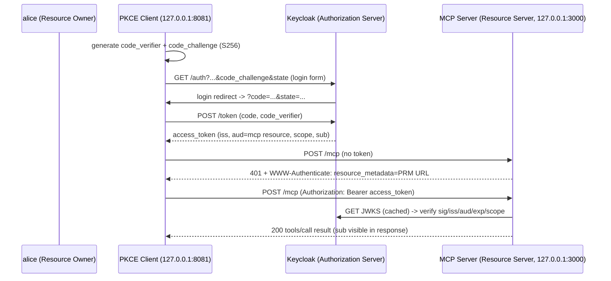

# MCP OAuth 2.1 Demo — Keycloak + PKCE

Locally-runnable educational project:

- **Keycloak 26** in Docker as the OAuth 2.0/2.1 Authorization Server (IdP)
- **TypeScript MCP server** (Express + `@modelcontextprotocol/sdk`) acting as an **OAuth 2.0 Resource Server**: validates JWT signature/issuer/audience (RFC 8707) and scope, exposes RFC 9728 Protected Resource Metadata, rejects cross-origin requests (DNS-rebinding defense)
- **Client script** demonstrating the full **Authorization Code + PKCE (S256)** flow end-to-end, including 401 (no token) and 403 (insufficient scope) negative paths

## Layout

```
keycloak/       docker-compose.yml + realm-export.json (realm "mcp-demo")
server/         MCP resource server (Express, jose JWT validation)
client/         PKCE client demo scripts
```

## Run manually

Prereqs: Docker, Node 22.

1. Start Keycloak (imports realm `mcp-demo` on first boot):

```bash
cd keycloak && docker compose up -d
```

Expected log line: `KC-SERVICES0032: Import finished successfully`

2. Start the MCP resource server:

```bash
cd ../server && npm install
npx tsx server.ts
```

Expected output:

```
MCP resource server listening on http://127.0.0.1:3000/mcp
Resource: http://127.0.0.1:3000/mcp
Issuer:   http://127.0.0.1:8080/realms/mcp-demo
Required scope: mcp:tools.read
```

3. Run the PKCE client (drives the real Authorization Code + PKCE flow; the
   "browser" login step is scripted via HTTP so no clicking is needed):

```bash
cd ../client && npm install
npx tsx pkce-client.ts
```

Expected output (verified locally):

```
=== 1. Authorization request (Authorization Code + PKCE) ===
code_challenge (sent, S256):    <43-char base64url>
=== 2. Simulating browser login as 'alice' against Keycloak ===
Received authorization code: <uuid>...
=== 3. Exchanging code for tokens at the token endpoint (with code_verifier) ===
Token exchange OK. Decoded access token claims:
  iss:  http://127.0.0.1:8080/realms/mcp-demo
  aud:  http://127.0.0.1:3000/mcp        <- RFC 8707 audience via Keycloak audience mapper
  scope: openid mcp:tools.read
=== 4. Calling MCP server WITHOUT a token (expect 401) ===
Status: 401
WWW-Authenticate: Bearer resource_metadata="http://127.0.0.1:3000/.well-known/oauth-protected-resource/mcp", error="invalid_token"
=== 5. MCP initialize + tools/call('hello') WITH valid token ===
initialize status: 200
tools/call(hello) status: 200   -> "Hello, Miguel! Authenticated as sub=<uuid>"
tools/call(whoami) status: 200  -> {"sub":"<uuid>","scopes":["openid","mcp:tools.read"]}
```

4. Negative path — valid token but missing the `mcp:tools.read` scope:

```bash
npx tsx insufficient-scope-demo.ts
```

Expected: `Status: 403` with `WWW-Authenticate: ... error="insufficient_scope" scope="mcp:tools.read"`.

## Flow diagram



## How it works

- The client generates `code_verifier` / `code_challenge` (S256), opens the
  Keycloak authorization endpoint with a `state` nonce, completes the login
  form POST (scripted), receives the `code` on the loopback redirect
  (`http://127.0.0.1:8081/callback`), and exchanges it — with the verifier —
  at the token endpoint.
- The realm export wires an **audience mapper** so access tokens carry
  `aud = http://127.0.0.1:3000/mcp` (RFC 8707 resource indicator); the server
  rejects tokens whose audience doesn't match.
- The server fetches Keycloak's JWKS and verifies `iss`, `aud`, expiry, and
  the required scope `mcp:tools.read` before serving any MCP request. 401/403
  responses carry RFC 6750 `WWW-Authenticate` headers pointing at the RFC 9728
  metadata endpoint (MCP auth discovery).
- Each POST /mcp uses a stateless Streamable HTTP transport (one transport per
  request, `sessionIdGenerator: undefined`).

## Keycloak credentials (local throwaway only)

- Admin console: http://127.0.0.1:8080/admin/master/console/ — `admin` / `admin`
- Realm `mcp-demo` user: `alice` / `alice-throwaway-local-pw`

## Notes

- `start-dev` mode and plain HTTP are for local education only — never
  production.
- The `insufficient-scope-demo.ts` uses the direct-grant (password) flow purely
  as a shortcut to mint a low-scope token for the 403 test; the primary demo
  flow is Authorization Code + PKCE.
- Realm import runs only on a fresh database: after editing
  `realm-export.json`, run `docker compose down && docker compose up -d` to
  reimport.